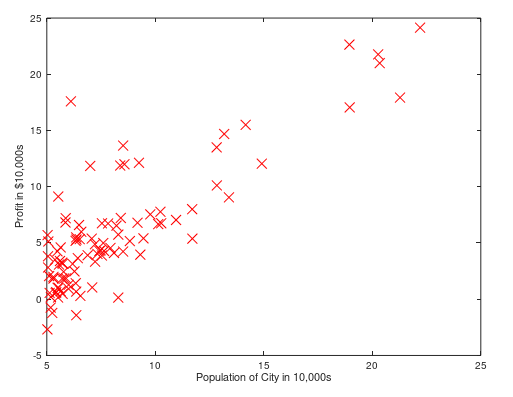

# Machine-learning-ex
programming exercise answer of Machine Learning course(Andrew Ng)

@toc

## Programming Exercise 1: Linear Regression

### Linear regression with one variable

>In this part of this exercise, you will implement linear regression with one variable to predict profits for a food truck. Suppose you are the CEO of a restaurant franchise and are considering different cities for opening a new outlet. The chain already has trucks in various cities and you have data for profits and populations from the cities.
You would like to use this data to help you select which city to expand to next. The file ex1data1.txt contains the dataset for our linear regression problem. The first column is the population of a city and the second column is the profit of a food truck in that city. A negative value for profit indicates a loss. 

1) Plotting the Data

```octave
data = load('ex1data1.txt'); % read comma separated data 
X = data(:, 1); y = data(:, 2); 
m = length(y); % number of training examples

plot(x, y, 'rx', 'MarkerSize',10);
ylabel('Profit in $10,000s');
xlabel('Population of City in 10,000s');
```



2)  Computing the cost J(θ)


$$
h _ { \theta } ( x ) = \theta ^ { T } x = \theta _ { 0 } + \theta _ { 1 } x _ { 1 }
$$

$$
J ( \theta ) = \frac { 1 } { 2 m } \sum _ { i = 1 } ^ { m } \left( h _ { \theta } \left( x ^ { ( i ) } \right) - y ^ { ( i ) } \right) ^ { 2 }
$$

```octave
X = [ones(m, 1), data(:,1)]; % Add a column of ones to x 
theta = zeros(2, 1); % initialize fitting parameters
m = length(y); % number of training examples

h = X * theta;
J = 1/(2*m)*sum((h-y).^2);
```

3) Gradient descent

$$
\theta _ { j } : = \theta _ { j } - \alpha \frac { 1 } { m } \sum _ { i = 1 } ^ { m } \left( h _ { \theta } \left( x ^ { ( i ) } \right) - y ^ { ( i ) } \right) x _ { j } ^ { ( i ) }
$$

```octave
iterations = 1500; 
alpha = 0.01;
m = length(y); 
J_history = zeros(num_iters, 1);

for iter = 1:num_iters

  delta = sum((X*theta-y).*X);
  theta = theta - alpha/m * delta';
  
  J_history(iter) = computeCost(X, y, theta);
end
```


