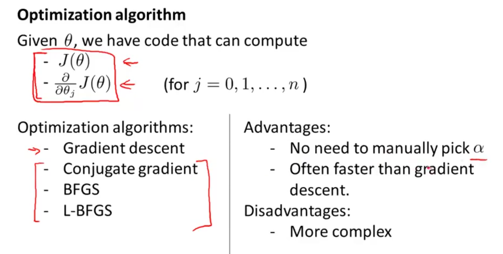
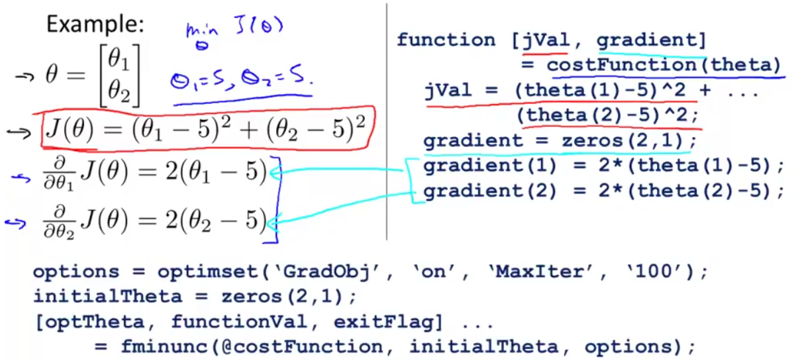

# advanced optimization

除了梯度下降之外，还有其他高级优化算法计算参数 theta 的值，如"Conjugate gradient", "BFGS",  "L-BFGS"。它们往往不需要手动选择 alpha，并且收敛的比梯度下降更快，缺点是算法比较复杂，但可以直接调用库函数实现。



在 octave 中可用 `fminunc()` 函数（无约束最小化函数）



### 代码

**costFunction.m：**

```octave
function [jVal, gradient] = costFunction(theta)

  % 计算代价函数 J(theta) 和梯度 gradient（偏导数）
  jVal = (theta(1)-5)^2 + (theta(2)-5)^2;
  gradient = zeros(2,1);
  gradient(1) = 2*(theta(1)-5);
  gradient(2) = 2*(theta(2)-5);
  
end
```

**主函数/命令行：**

```octave
% optimset()用于创建一个存储options的对象
% 设置梯度目标参数(GradObj)为打开(on)，代表要给这个算法提供一个梯度
% 设置最大迭代次数为100
options = optimset('GradObj', 'on', 'MaxIter', 100); 

% 设置theta的猜测初始值，用于fminunc的theta必须是二维以上
initialTheta = zeros(2,1);

% 调用fminunc，将自动选取众多高级优化算法中的一个用来计算
% exitFlag 为1时代表算法收敛
% @costFunction 为指向定义好的costFunction函数的指针
[optTheta, functionVal, exitFlag] = fminunc(@costFunction, initialTheta, options);
```
